# IAM - Mermaid Diagrams

## IAM Components Overview

### IAM Core Components Relationship


### IAM Hierarchy and Structure

```mermaid
graph TB
    Root[AWS Account Root User<br/>⚠️ Complete Access]
    
    Root --> AdminGroup[Administrators Group]
    Root --> DevGroup[Developers Group]
    Root --> OpsGroup[Operations Group]
    
    AdminGroup --> AdminPolicy[AdministratorAccess<br/>Policy]
    DevGroup --> DevPolicy[Developer Policy<br/>Limited EC2, S3, RDS]
    OpsGroup --> OpsPolicy[Operations Policy<br/>Read-Only + CloudWatch]
    
    AdminGroup --> User1[Alice]
    AdminGroup --> User2[Bob]
    
    DevGroup --> User3[Charlie]
    DevGroup --> User4[Diana]
    
    OpsGroup --> User5[Eve]
    
    User1 -.Additional Policy.-> MFAPolicy[MFA Policy]
    
    style Root fill:#C00
    style AdminGroup fill:#FF9900
    style DevGroup fill:#FF9900
    style OpsGroup fill:#FF9900
    style AdminPolicy fill:#146EB4
```



## IAM Users and Authentication

### User Authentication Flow

```mermaid
sequenceDiagram
    actor User
    participant Console as AWS Console
    participant IAM
    participant MFA as MFA Device
    participant Service as AWS Service
    
    User->>Console: Enter Username & Password
    Console->>IAM: Validate Credentials
    IAM->>Console: Request MFA Token
    Console->>User: Prompt for MFA
    User->>MFA: Generate Token
    MFA->>User: 6-digit Code
    User->>Console: Enter MFA Token
    Console->>IAM: Validate MFA
    IAM->>Console: Session Token
    Console->>User: Access Granted
    User->>Service: Perform Action
    Service->>IAM: Verify Permissions
    IAM->>Service: Allow/Deny
    Service->>User: Result
    
    style IAM fill:#FF9900
    style MFA fill:#146EB4
```

### Access Keys for Programmatic Access


## IAM Groups

### Groups Management Pattern


## IAM Roles

### IAM Role Assumption Flow

```mermaid
sequenceDiagram
    participant EC2 as EC2 Instance
    participant STS as AWS STS
    participant Role as IAM Role
    participant S3 as S3 Bucket
    
    Note over EC2: Instance has IAM Role attached
    EC2->>STS: AssumeRole Request
    STS->>Role: Validate Trust Policy
    Role->>STS: Trust Policy Valid
    STS->>EC2: Temporary Security Credentials<br/>(Access Key + Secret + Token)
    Note over EC2: Credentials valid for 1 hour
    EC2->>S3: Access S3 using temporary credentials
    S3->>Role: Check Permissions Policy
    Role->>S3: Allow/Deny
    S3->>EC2: Return Data
    
    style EC2 fill:#FF9900
    style STS fill:#146EB4
    style Role fill:#569A31
```

### Common Role Use Cases


### Role Trust Policy vs Permission Policy


## IAM Policies

### Policy Types Overview


### Policy Evaluation Logic

```mermaid
flowchart TD
    Start([API Request]) --> Default{Default Deny}
    
    Default --> Explicit{Explicit Deny<br/>Exists?}
    Explicit -->|Yes| Deny([❌ DENY])
    Explicit -->|No| SCP{SCP<br/>Allows?}
    
    SCP -->|No| Deny
    SCP -->|Yes| Boundary{Permission Boundary<br/>Allows?}
    
    Boundary -->|No| Deny
    Boundary -->|Yes| Identity{Identity Policy<br/>Allows?}
    
    Identity -->|No| Resource{Resource Policy<br/>Allows?}
    Identity -->|Yes| Allow([✅ ALLOW])
    
    Resource -->|Yes| Allow
    Resource -->|No| Deny
    
    style Start fill:#232F3E
    style Allow fill:#569A31
    style Deny fill:#C00
    style Explicit fill:#FF9900
```



### Policy Structure Example


## Multi-Factor Authentication (MFA)

### MFA Authentication Process

```mermaid
sequenceDiagram
    actor User
    participant Device as MFA Device
    participant AWS
    participant IAM
    
    User->>AWS: Login with Password
    AWS->>IAM: Validate Password
    IAM->>AWS: Password Valid
    AWS->>User: Request MFA Token
    User->>Device: Request Token
    Device->>Device: Generate Time-based Token
    Device->>User: Display 6-digit Code
    User->>AWS: Enter MFA Code
    AWS->>IAM: Validate MFA Token
    IAM->>AWS: MFA Valid
    AWS->>User: Access Granted ✅
    
    style IAM fill:#FF9900
    style Device fill:#146EB4
```

### MFA Device Types


## Cross-Account Access

### Cross-Account Role Assumption

```mermaid
sequenceDiagram
    participant UserA as User in Account A<br/>(Dev Account)
    participant STSA as STS Account A
    participant Role as Cross-Account Role<br/>in Account B
    participant STSb as STS Account B
    participant S3 as S3 in Account B<br/>(Prod Account)
    
    Note over UserA,S3: Setup: Account B creates role trusting Account A
    
    UserA->>STSA: Authenticate
    STSA->>UserA: Session Credentials
    UserA->>STSb: AssumeRole (Account B Role)
    STSb->>Role: Check Trust Policy
    Role->>STSb: Account A is Trusted
    STSb->>UserA: Temporary Credentials
    Note over UserA: Credentials valid 15min-12hrs
    UserA->>S3: Access S3 with temp credentials
    S3->>UserA: Return Data
    
    style Role fill:#FF9900
    style STSb fill:#146EB4
```

### Cross-Account Architecture


## Identity Federation

### SAML 2.0 Federation Flow

```mermaid
sequenceDiagram
    actor User
    participant IdP as Identity Provider<br/>(Active Directory/ADFS)
    participant AWS
    participant STS as AWS STS
    participant Console as AWS Console
    
    User->>IdP: 1. Login with corporate credentials
    IdP->>User: 2. Authenticate
    IdP->>User: 3. Return SAML Assertion
    User->>STS: 4. AssumeRoleWithSAML + SAML Assertion
    STS->>STS: 5. Validate SAML Assertion
    STS->>User: 6. Temporary Security Credentials
    User->>Console: 7. Access AWS Console
    
    style IdP fill:#FF9900
    style STS fill:#146EB4
```

### Web Identity Federation (Cognito)


## IAM Best Practices

### Security Best Practices Flow

```mermaid
flowchart TD
    Start([IAM Best Practices]) --> Root[🔐 Secure Root Account]
    
    Root --> RootMFA[Enable MFA on Root]
    Root --> RootNoUse[Don't use Root for daily tasks]
    Root --> RootKeys[Delete Root Access Keys]
    
    RootNoUse --> Users[Create Individual IAM Users]
    Users --> Groups[Use Groups for Permissions]
    Groups --> LeastPriv[Apply Least Privilege]
    
    LeastPriv --> Policies[Use AWS Managed Policies]
    Policies --> Review[Regular Access Review]
    
    Review --> MFA[Enable MFA for All Users]
    MFA --> Rotate[Rotate Credentials Regularly]
    Rotate --> Conditions[Use Policy Conditions]
    
    Conditions --> Roles[Use Roles for Applications]
    Roles --> Monitor[Monitor with CloudTrail]
    Monitor --> End([Secure IAM Setup ✅])
    
    style Start fill:#232F3E
    style Root fill:#C00
    style End fill:#569A31
    style LeastPriv fill:#FF9900
```



### Permission Boundary Pattern

```mermaid
graph TB
    subgraph "Permission Evaluation"
        MaxPerm[Maximum Permissions<br/>Permission Boundary]
        IdentityPerm[Identity Policy<br/>What user can do]
        Effective[Effective Permissions<br/>Intersection]
        
        MaxPerm --> Effective
        IdentityPerm --> Effective
    end
    
    subgraph "Example"
        Boundary["Boundary Policy:<br/>• Allow: EC2, S3, RDS<br/>• Region: us-east-1"]
        
        UserPolicy["User Policy:<br/>• Allow: EC2:*<br/>• Allow: S3:*<br/>• Allow: Lambda:*<br/>• All Regions"]
        
        Result["Effective Permission:<br/>• Allow: EC2:* (us-east-1)<br/>• Allow: S3:* (us-east-1)<br/>❌ No RDS (not in user policy)<br/>❌ No Lambda (not in boundary)"]
    end
    
    Boundary -.AND.-> Result
    UserPolicy -.AND.-> Result
    
    style Effective fill:#569A31
    style Result fill:#FF9900
```



## IAM Access Analyzer

### Access Analyzer Architecture


## IAM Database Authentication

### RDS IAM Authentication Flow

```mermaid
sequenceDiagram
    participant App as Application
    participant IAM
    participant RDS as RDS MySQL/PostgreSQL
    
    Note over App: Has IAM Role with rds-db:connect permission
    
    App->>IAM: Request Authentication Token
    IAM->>IAM: Verify IAM Credentials
    IAM->>App: Return Auth Token (15 min validity)
    
    App->>RDS: Connect with username + auth token
    RDS->>IAM: Validate Token
    IAM->>RDS: Token Valid
    RDS->>App: Connection Established
    
    Note over App,RDS: Benefits: No password storage, IAM centralized auth, SSL enforced
    
    style IAM fill:#FF9900
    style RDS fill:#3B48CC
```

